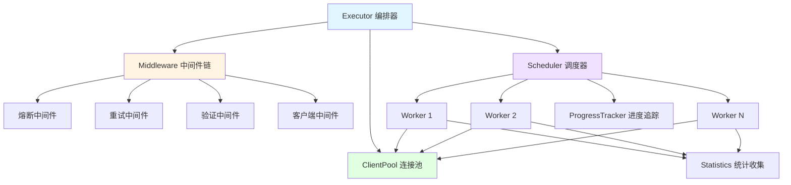

# go-stress

[](https://github.com/kamalyes/go-stress)
[](https://godoc.org/github.com/kamalyes/go-stress)
[](https://github.com/kamalyes/go-stress/blob/main/LICENSE)

一个功能强大、架构优雅的 Go 语言压测工具，采用分层架构和中间件模式，支持 HTTP/gRPC 协议，提供熔断、重试、连接池等企业级特性

## 📖 核心特性

| 特性 | 说明 |
|:-----|:-----|
| � **curl 命令解析** | 自动识别 Unix/Windows curl 命令风格，快速生成配置 |
| 🏗️ **分层架构** | Executor、Scheduler、Worker 分层设计，职责清晰 |
| 🔌 **中间件模式** | 可插拔的中间件链：熔断、重试、验证 |
| 🏊 **连接池管理** | 智能连接复用，减少70%内存占用 |
| ⚡ **高性能** | 支持高并发压测，智能调度和资源管理 |
| 🛡️ **熔断保护** | 防止服务雪崩，智能流量控制 |
| 🔄 **自动重试** | 可配置的重试策略，提高成功率 |
| ✅ **响应验证** | 支持状态码、JSON、正则等多种验证方式 |
| 📊 **实时统计** | 详细的性能报告：QPS、延迟、成功率 |
| 🌐 **多协议支持** | HTTP、gRPC、WebSocket（规划中） |
| 📈 **渐进启动** | Ramp-up 模式，平滑增加负载 |
| 📊 **进度跟踪** | 实时显示进度和预估完成时间 |
| 🎯 **类型安全** | 泛型设计，编译时类型检查 |
| 🌍 **跨平台** | 支持 macOS、Linux、Windows |

> 📖 **架构设计**：查看 [架构文档](docs/ARCHITECTURE.md) 了解详细的设计思路

## 🏗️ 架构概览



### 核心概念

- **Executor（编排器）**：负责组装和协调所有组件，生成最终报告
- **Scheduler（调度器）**：管理 Worker 生命周期，实现并发控制和渐进启动
- **Worker（工作单元）**：执行具体的压测请求，维护单个并发单元的状态
- **Middleware（中间件）**：以责任链模式处理请求：熔断 → 重试 → 验证 → 发送
- **ClientPool（连接池）**：复用客户端连接，优化资源使用
- **ProgressTracker（进度追踪）**：实时显示进度、速率和预估时间

## 📦 安装

```bash
go get github.com/kamalyes/go-stress
```

## 🚀 快速开始

### 方式一：从 curl 命令快速开始

```go
package main

import (
    "context"
    "fmt"
    
    "github.com/kamalyes/go-stress/config"
    "github.com/kamalyes/go-stress/executor"
)

func main() {
    // 1. 从 curl 命令解析配置（自动识别 Unix/Windows 风格）
    curlCmd := `curl 'http://localhost:8080/api/users' \
      -H 'Content-Type: application/json' \
      -H 'Authorization: Bearer token123' \
      --data-raw '{"name":"test"}' \
      --insecure`
    
    cfg, err := config.ParseCurlCommand(curlCmd)
    if err != nil {
        panic(err)
    }
    
    // 2. 设置压测参数
    cfg.Concurrency = 100    // 并发数
    cfg.Requests = 1000      // 每个并发的请求数
    
    // 3. 创建执行器并运行
    exec, _ := executor.NewExecutor(cfg)
    report, _ := exec.Run(context.Background())
    
    // 4. 查看结果
    fmt.Printf("总请求数: %d\n", report.TotalRequests)
    fmt.Printf("成功率: %.2f%%\n", report.SuccessRate)
    fmt.Printf("QPS: %.2f\n", report.QPS)
}
```

### 方式二：从 curl 文件加载

```go
// 从文件加载 curl 命令
cfg, err := config.ParseCurlFile("./api_request.curl")
cfg.Concurrency = 50
cfg.Requests = 500

exec, _ := executor.NewExecutor(cfg)
report, _ := exec.Run(context.Background())
```

### 方式三：手动配置

```go
package main

import (
    "context"
    "fmt"
    "time"
    
    "github.com/kamalyes/go-stress/config"
    "github.com/kamalyes/go-stress/executor"
    "github.com/kamalyes/go-stress/types"
)

func main() {
    // 1. 创建配置
    cfg := &config.Config{
        Protocol:    types.ProtocolHTTP,
        URL:         "http://localhost:8080/api",
        Method:      "GET",
        Concurrency: 100,      // 并发数
        Requests:    1000,     // 每个并发的请求数
        Timeout:     10 * time.Second,
    }
    
    // 2. 创建执行器
    exec, err := executor.NewExecutor(cfg)
    if err != nil {
        panic(err)
    }
    
    // 3. 执行压测
    report, err := exec.Run(context.Background())
    if err != nil {
        panic(err)
    }
    
    // 4. 查看结果
    fmt.Printf("总请求数: %d\n", report.TotalRequests)
    fmt.Printf("成功率: %.2f%%\n", report.SuccessRate)
    fmt.Printf("QPS: %.2f\n", report.QPS)
    fmt.Printf("平均延迟: %v\n", report.AvgDuration)
}
```

## 🏗️ 高级特性

### curl 命令解析

自动识别并解析两种风格的 curl 命令：

**Unix/Bash 风格**（使用 `\` 续行符和单引号）：

```bash
curl 'http://api.example.com/users' \
  -H 'Content-Type: application/json' \
  -H 'Authorization: Bearer token' \
  --data-raw '{"name":"test"}' \
  --insecure
```

**Windows CMD 风格**（使用 `^` 转义符和双引号）：

```cmd
curl ^"http://api.example.com/users^" ^
  -H ^"Content-Type: application/json^" ^
  -H ^"Authorization: Bearer token^" ^
  --data-raw ^"^{^\^"name^\^":^\^"test^\^"^}^" ^
  --insecure
```

程序会自动检测风格（通过统计 `^` 和 `\` 的出现频率）并应用相应的解析策略

### 中间件配置

```go
cfg := &config.Config{
    // ... 基本配置
    
    // 启用熔断
    Advanced: &config.AdvancedConfig{
        EnableBreaker: true,
        MaxFailures:   10,
        ResetTimeout:  30 * time.Second,
        
        EnableRetry: true,     // 启用重试
        RampUp:      10 * time.Second, // 渐进启动
    },
    
    // 响应验证
    Verify: &config.VerifyConfig{
        Type: string(types.VerifyStatusCode),
        Rules: map[string]interface{}{
            "expected": 200,
        },
    },
}
```

### 中间件扩展

```go
// 自定义中间件
func CustomMiddleware() executor.Middleware {
    return func(next executor.RequestHandler) executor.RequestHandler {
        return func(ctx context.Context, req *types.Request) (*types.Response, error) {
            // 前置处理
            resp, err := next(ctx, req)
            // 后置处理
            return resp, err
        }
    }
}

// 使用中间件链
chain := executor.NewMiddlewareChain()
chain.Use(CustomMiddleware())
chain.Use(executor.BreakerMiddleware(circuit))
```

## 🧪 测试

```bash
go test ./... -v                    # 运行所有测试
go test ./... -cover                # 测试覆盖率
go test -v -run TestExecutor        # 运行特定测试
```

### GitHub Actions 自动构建

项目已配置 GitHub Actions 自动化工作流：

**CI/CD Pipeline** (`.github/workflows/pipeline.yml`)

- 在 `push` 到 `develop` 分支时触发
- 支持手动触发 (`workflow_dispatch`)，可选择部署环境和是否进行代码质量检查
- **代码质量检查**：
  - 运行单元测试和集成测试
  - golangci-lint 代码质量扫描
- **多平台构建**：
  - 并行构建 6 个平台的二进制文件：
    - Windows (amd64/arm64)
    - Linux (amd64/arm64)
    - macOS (amd64/arm64)
  - 支持 UPX 压缩优化
  - 自动上传构建产物到 GitHub Artifacts

**使用方法：**

```bash
# 1. 推送到 develop 分支自动触发构建
git push origin develop

# 2. 手动触发构建（可选择环境和选项）
# 在 GitHub Actions 页面选择 "CI/CD Pipeline" workflow
# 点击 "Run workflow" 按钮，选择：
#    - 部署环境: dev/test/uat/prod
#    - 是否进行代码质量检查

# 3. 查看构建产物
# 在 Actions 运行页面下载对应平台的二进制文件
# 产物格式：binary-name-os-arch (如: go-stress-linux-amd64)
```

**配置说明：**

在 GitHub 仓库的 Settings → Secrets and variables → Actions 中配置：

- `GIT_SSH_PRIVATE_KEY`: 用于访问私有 Go 模块的 SSH 私钥

## �📚 相关资源

- 📖 [架构设计文档](docs/ARCHITECTURE.md) - 详细的架构设计和组件说明
- 🐛 [问题反馈](https://github.com/kamalyes/go-stress/issues) - 报告 bug 或提出建议
- 💬 [讨论区](https://github.com/kamalyes/go-stress/discussions) - 技术交流

## 📦 依赖

- [go-toolbox](https://github.com/kamalyes/go-toolbox) - 熔断器、重试器等工具
- [go-logger](https://github.com/kamalyes/go-logger) - 结构化日志

## 🤝 贡献

1. Fork 本仓库
2. 创建特性分支 (`git checkout -b feature/amazing-feature`)
3. 提交更改 (`git commit -m '✨ feat: Add amazing feature'`)
4. 推送到分支 (`git push origin feature/amazing-feature`)
5. 开启 Pull Request

## 📋 Git Commit Emoji 规范

<details>
<summary>点击展开 Emoji 规范表</summary>

| Emoji | 类型 | 说明 |
|:-----:|------|------|
| ✨ | feat | 新功能 |
| 🐛 | fix | 修复 bug |
| 📝 | docs | 文档更新 |
| ♻️ | refactor | 代码重构 |
| ⚡ | perf | 性能优化 |
| ✅ | test | 测试相关 |
| 🔧 | chore | 配置/构建 |
| 🚀 | deploy | 部署发布 |
| 🔒 | security | 安全修复 |
| 🔥 | remove | 删除代码 |

**示例：** `git commit -m "✨ feat(executor): 新增中间件链支持"`

</details>

## 📄 许可证

MIT License - 详见 [LICENSE](LICENSE)

## 👨‍💻 作者

Kamal Yang ([@kamalyes](https://github.com/kamalyes))
