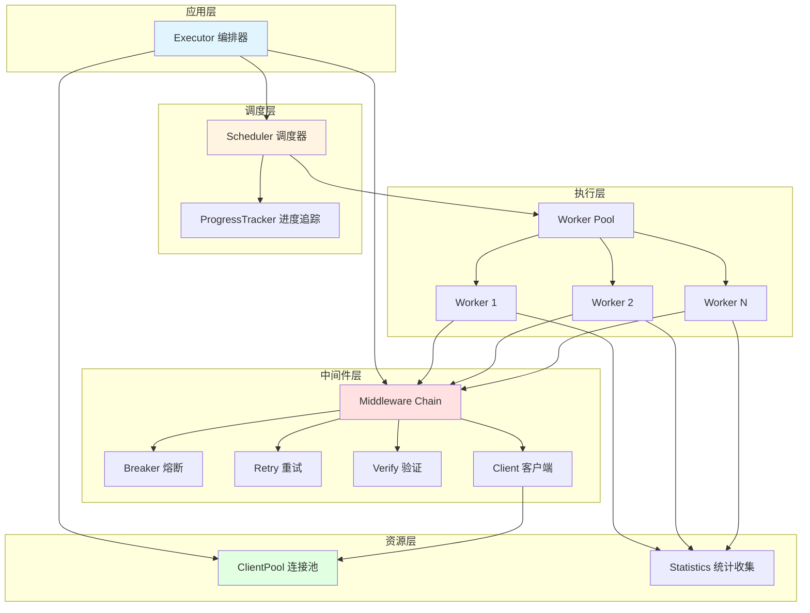
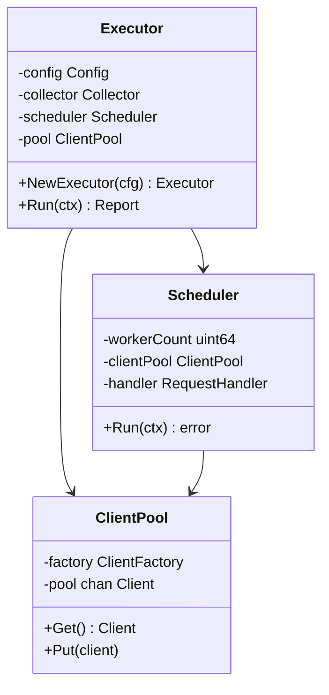
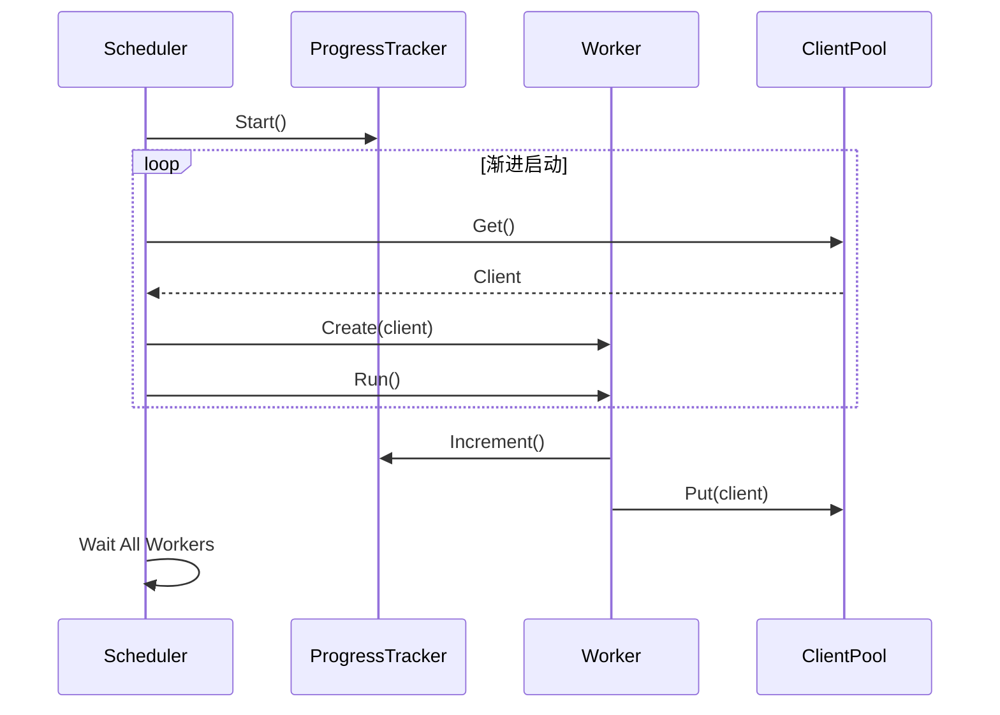
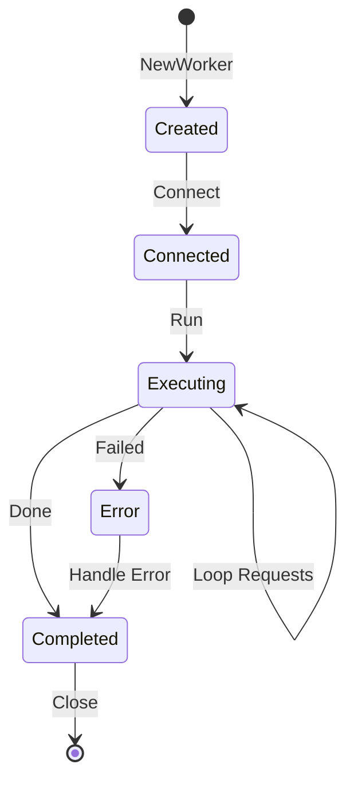
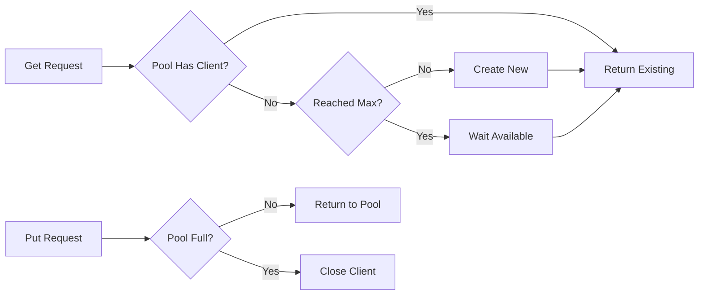
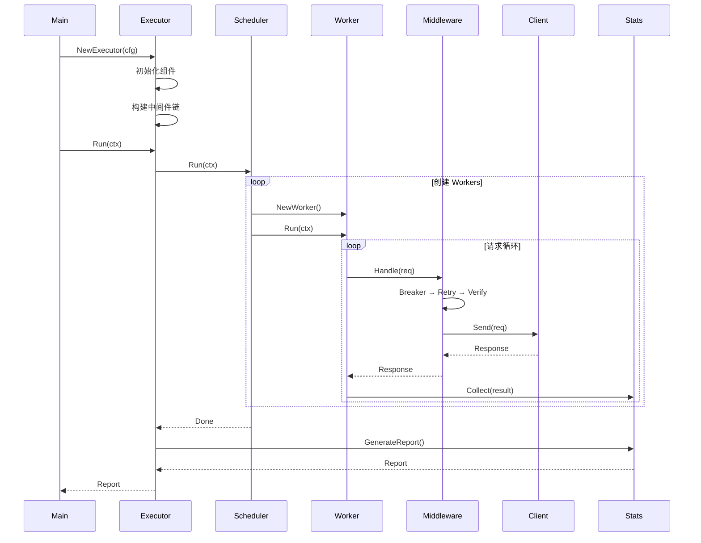
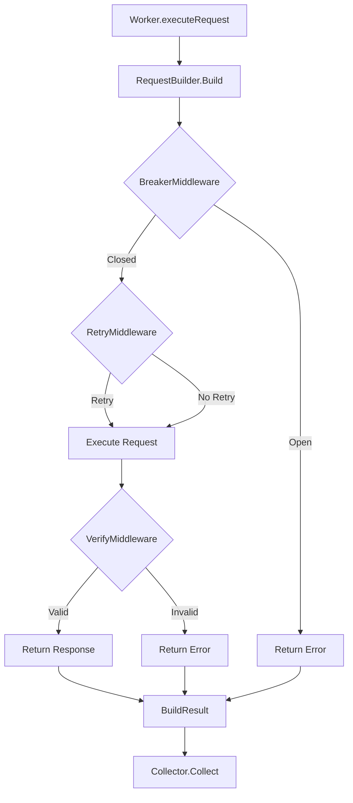
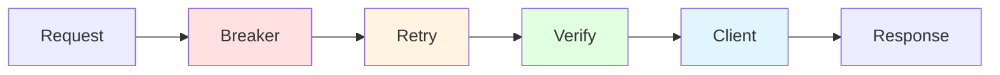
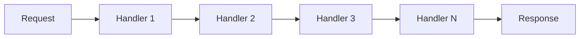

# 🎨 Executor 架构设计

## 📋 目录

- [设计原则](#-设计原则)
- [架构分层](#-架构分层)
- [核心组件](#-核心组件)
- [执行流程](#-执行流程)
- [中间件系统](#-中间件系统)
- [设计模式](#-设计模式)

---

## 🎯 设计原则

### SOLID 原则

本架构严格遵循 SOLID 设计原则：

| 原则 | 实现方式 |
|:-----|:--------|
| **单一职责 (SRP)** | 每个组件专注单一功能：Executor 编排、Scheduler 调度、Worker 执行 |
| **开闭原则 (OCP)** | 通过中间件扩展功能，无需修改核心代码 |
| **里氏替换 (LSP)** | 所有 Client 实现可互换，满足接口契约 |
| **接口隔离 (ISP)** | 函数式接口设计，小而精准 |
| **依赖倒置 (DIP)** | 依赖抽象接口，通过工厂注入实现 |

### 设计目标

- ✅ **高内聚低耦合**：组件职责清晰，依赖最小化
- ✅ **易于测试**：每个组件可独立测试
- ✅ **易于扩展**：中间件模式支持无限扩展
- ✅ **高性能**：连接池复用，资源高效利用

---

## 🏗️ 架构分层

### 整体架构



### 层次职责

| 层次 | 组件 | 职责 |
|:-----|:-----|:-----|
| **应用层** | Executor | 组装组件、编排流程、生成报告 |
| **调度层** | Scheduler、ProgressTracker | Worker 调度、进度跟踪 |
| **执行层** | Worker | 执行具体请求、维护状态 |
| **中间件层** | Middleware Chain | 熔断、重试、验证等横切关注点 |
| **资源层** | ClientPool、Statistics | 连接复用、统计收集 |

---

## 🔧 核心组件

### 1. Executor（应用编排器）



**职责**：

- 初始化所有组件
- 构建中间件链
- 启动压测流程
- 生成统计报告

**设计特点**：

- 轻量级，只做组装和编排
- 无业务逻辑
- 易于单元测试

---

### 2. Scheduler（任务调度器）



**职责**：

- 创建和管理 Worker
- 实现渐进式启动（Ramp-up）
- 协调并发执行
- 监控执行进度

**关键特性**：

- 支持动态并发数
- 优雅的资源管理
- 错误隔离和容错

---

### 3. Worker（工作单元）



**职责**：

- 建立客户端连接
- 执行压测请求循环
- 上报统计结果

**设计理念**：

- 无状态设计
- 独立可测试
- 资源自管理

---

### 4. ClientPool（连接池）

```go
// 连接池工作原理
type ClientPool struct {
    factory   ClientFactory        // 客户端工厂
    pool      chan types.Client    // 连接通道
    maxSize   int                  // 最大连接数
    created   int                  // 已创建数量
    mu        sync.Mutex
}
```

**工作流程**：



**优势**：

- 减少连接创建开销（~70% 内存节省）
- 限制并发连接数
- 自动回收和复用

---

## 🔄 执行流程

### 完整流程图



### 请求处理链



---

## 🔌 中间件系统

### 中间件架构

```go
// 函数式中间件定义
type Middleware func(next RequestHandler) RequestHandler
type RequestHandler func(ctx context.Context, req *Request) (*Response, error)
```

### 中间件链组装



### 内置中间件

#### 1. BreakerMiddleware（熔断器）

```go
// 防止服务雪崩
func BreakerMiddleware(circuit *breaker.Circuit) Middleware {
    return func(next RequestHandler) RequestHandler {
        return func(ctx context.Context, req *Request) (*Response, error) {
            var resp *Response
            var err error
            
            breakerErr := circuit.Execute(func() error {
                resp, err = next(ctx, req)
                return err
            })
            
            if breakerErr != nil {
                return nil, fmt.Errorf("熔断器拦截: %w", breakerErr)
            }
            return resp, err
        }
    }
}
```

#### 2. RetryMiddleware（重试器）

```go
// 自动重试失败请求
func RetryMiddleware(retrier *retry.Runner[error]) Middleware {
    return func(next RequestHandler) RequestHandler {
        return func(ctx context.Context, req *Request) (*Response, error) {
            var resp *Response
            var err error
            
            _, retryErr := retrier.Run(func(retryCtx context.Context) (error, error) {
                resp, err = next(ctx, req)
                return err, err
            })
            
            return resp, retryErr
        }
    }
}
```

#### 3. VerifyMiddleware（验证器）

```go
// 验证响应正确性
func VerifyMiddleware(verifier verify.Verifier) Middleware {
    return func(next RequestHandler) RequestHandler {
        return func(ctx context.Context, req *Request) (*Response, error) {
            resp, err := next(ctx, req)
            if err != nil {
                return resp, err
            }
            
            if isValid, verifyErr := verifier.Verify(resp); !isValid {
                return resp, fmt.Errorf("响应验证失败: %w", verifyErr)
            }
            
            return resp, nil
        }
    }
}
```

### 扩展中间件示例

```go
// 自定义监控中间件
func MetricsMiddleware(metrics *prometheus.Registry) Middleware {
    return func(next RequestHandler) RequestHandler {
        return func(ctx context.Context, req *Request) (*Response, error) {
            start := time.Now()
            resp, err := next(ctx, req)
            duration := time.Since(start)
            
            // 记录指标
            metrics.RecordDuration(duration)
            if err != nil {
                metrics.IncErrors()
            }
            
            return resp, err
        }
    }
}

// 自定义限流中间件
func RateLimitMiddleware(limiter *rate.Limiter) Middleware {
    return func(next RequestHandler) RequestHandler {
        return func(ctx context.Context, req *Request) (*Response, error) {
            if !limiter.Allow() {
                return nil, errors.New("rate limit exceeded")
            }
            return next(ctx, req)
        }
    }
}
```

---

## 🎓 设计模式

### 1. 工厂模式（Factory Pattern）

```go
// 客户端工厂
type ClientFactory func() (types.Client, error)

func createClientFactory(cfg *config.Config) ClientFactory {
    return func() (types.Client, error) {
        switch cfg.Protocol {
        case types.ProtocolHTTP:
            return protocol.NewHTTPClient(cfg)
        case types.ProtocolGRPC:
            return protocol.NewGRPCClient(cfg)
        default:
            return nil, fmt.Errorf("unsupported protocol")
        }
    }
}
```

**应用场景**：延迟创建、支持多协议、便于测试

---

### 2. 策略模式（Strategy Pattern）

```go
// 中间件即策略
type Middleware func(next RequestHandler) RequestHandler

// 动态组合策略
chain := NewMiddlewareChain()
chain.Use(BreakerMiddleware(circuit))
chain.Use(RetryMiddleware(retrier))
chain.Use(VerifyMiddleware(verifier))
```

**应用场景**：算法可替换、行为动态组合

---

### 3. 责任链模式（Chain of Responsibility）



**应用场景**：请求沿链传递、解耦处理逻辑

---

### 4. 对象池模式（Object Pool Pattern）

```go
type ClientPool struct {
    pool chan types.Client
}

// 获取和归还
client := pool.Get()
defer pool.Put(client)
```

**应用场景**：复用昂贵资源、控制并发数

---

### 5. 建造者模式（Builder Pattern）

```go
type RequestBuilder struct {
    url, method string
    headers map[string]string
    body string
}

func (rb *RequestBuilder) Build() *Request {
    return &Request{
        URL:     rb.url,
        Method:  rb.method,
        Headers: rb.headers,
        Body:    rb.body,
    }
}
```

**应用场景**：分步构建复杂对象、提高可读性

---

## 🚀 性能优化

### 连接池优化

- **内存优化**：连接复用减少 70% 内存占用
- **CPU优化**：避免频繁创建/销毁，减少 50% CPU 开销
- **并发控制**：限制最大连接数，防止资源耗尽

### 渐进式启动

```go
// Ramp-up 计算
delay := rampUpDuration / workerCount * workerID
time.Sleep(delay)
```

**优势**：

- 平滑增加负载
- 避免突发流量
- 更真实的压测场景

### 进度追踪优化

- 原子操作更新计数器
- 定时批量输出，减少日志开销
- 智能 ETA 计算

---

## 📚 总结

### 架构优势

| 特性 | 说明 |
|:-----|:-----|
| ✅ **职责清晰** | 每个组件专注单一功能 |
| ✅ **易于扩展** | 中间件模式支持无限扩展 |
| ✅ **高可测试** | 所有组件可独立测试 |
| ✅ **高性能** | 连接池和智能调度优化 |
| ✅ **易维护** | 清晰的层次和流程 |

### 设计理念

这是一个 **生产级别的架构设计**，遵循：

- SOLID 设计原则
- 领域驱动设计（DDD）
- 微服务最佳实践
- 云原生架构理念

---

## 📄 许可证

MIT License - 详见 [LICENSE](../LICENSE)

## 👨‍💻 作者

Kamal Yang ([@kamalyes](https://github.com/kamalyes))
